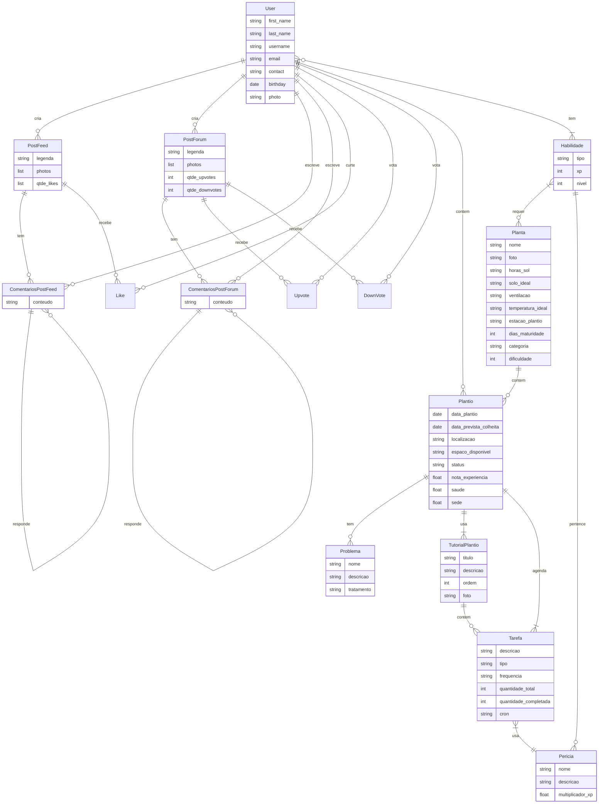

# Diagrama ER

```mermaid
erDiagram
  User {
    string first_name
    string last_name
    string username
    string email
    string contact
    date birthday
    string photo
  }

  Planta {
    string nome
    string foto
    string horas_sol
    string solo_ideal
    string ventilacao
    string temperatura_ideal
    string estacao_plantio
    int dias_maturidade
    string categoria
    int dificuldade
  }

  Plantio {
    date data_plantio
    date data_prevista_colheita
    string localizacao
    string espaco_disponivel
    string status
    float nota_experiencia
    float saude
    float sede
  }

  Problema {
    string nome
    string descricao
    string tratamento
  }

  TutorialPlantio {
    string titulo
    string descricao
    int ordem
    string foto
  }

  Tarefa {
    string descricao
    string tipo
    string frequencia
    int quantidade_total
    int quantidade_completada
    string cron
  }

  Pericia {
    string nome
    string descricao
    float multiplicador_xp
  }

  Habilidade {
    string tipo
    int xp
    int nivel
  }

  PostFeed {
    string legenda
    list photos
    list qtde_likes
  }

  ComentariosPostFeed {
    string conteudo
  }

  Like {
  }

  PostForum {
    string legenda
    list photos
    int qtde_upvotes
    int qtde_downvotes
  }

  ComentariosPostForum {
    string conteudo
  }

  Upvote {
  }

  DownVote {
  }

  %% Relationships
  User ||--o{ PostFeed : cria
  User ||--o{ PostForum : cria
  User ||--o{ ComentariosPostFeed : escreve
  User ||--o{ ComentariosPostForum : escreve
  User ||--o{ Like : curte
  User ||--o{ Upvote : vota
  User ||--o{ DownVote : vota
  User ||--o{ Plantio : contem
  User }o--|{ Habilidade : tem

  ComentariosPostFeed ||--o{ ComentariosPostFeed : responde

  PostFeed ||--o{ ComentariosPostFeed : tem
  PostFeed ||--o{ Like : recebe

  ComentariosPostForum ||--o{ ComentariosPostForum : responde

  PostForum ||--o{ ComentariosPostForum : tem
  PostForum ||--o{ Upvote : recebe
  PostForum ||--o{ DownVote : recebe

  Planta ||--o{ Plantio : contem

  Plantio ||--o{ Problema : tem
  Plantio ||--|{ TutorialPlantio : usa
  Plantio ||--|{ Tarefa : agenda

  TutorialPlantio ||--o{ Tarefa : contem

  Tarefa }|--|| Pericia : usa

  Habilidade }|--o{ Planta : requer
  Habilidade ||--o{ Pericia : pertence
```
